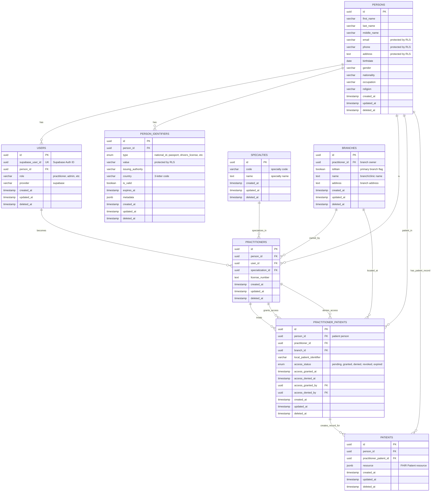

# AssociHealth Database Schema - Entity Relationship Diagram

## Schema Overview

### 🔐 **Core Identity Layer**

- **PERSONS**: Core identity with PHI protected by Row Level Security (RLS)
- **USERS**: Authentication layer linked to Supabase Auth
- **PERSON_IDENTIFIERS**: Government IDs, passports, etc. (Philippine-focused)

### 👩‍⚕️ **Practitioner Layer**

- **PRACTITIONERS**: Healthcare providers (doctors, dentists, etc.)
- **SPECIALTIES**: Medical specializations (dentistry, cardiology, etc.)
- **BRANCHES**: Practice locations/clinics

### 🏥 **Patient-Provider Relationship**

- **PRACTITIONER_PATIENTS**: Access control between providers and patients
  - `access_status`: pending → granted/denied → revoked/expired
  - Audit trail for access grants/denials
  - Branch assignment for multi-location practices

### 📋 **Patient Data**

- **PATIENTS**: FHIR-compliant patient records
  - Links to both person identity and practitioner relationship
  - JSONB storage for flexible FHIR resources

## 🔒 **Security Features**

### Row Level Security (RLS) Policies:

- **Patients** can only access their own data
- **Practitioners** can only access patients with `access_status = 'granted'`
- **PHI fields**: email, phone, address, identifier values protected by RLS
- **Audit trail**: All access grants/denials are tracked

### Access Control Flow:

1. Patient signs up → Creates PERSON + USER records
2. Practitioner requests access → Creates PRACTITIONER_PATIENTS with `access_status = 'pending'`
3. Patient grants access → Updates `access_status = 'granted'`
4. Practitioner can now access patient data → Creates PATIENTS record

## 🎯 **Key Benefits**

- **HIPAA Compliant**: RLS-protected PHI, access controls, audit trails
- **Scalable**: Multi-location practices, multiple specialties
- **FHIR Ready**: Standards-compliant patient data storage
- **Philippine Focused**: Government ID types, local requirements

## 📊 **Schema Validation Results**

### ✅ **Fully Interconnected**

All tables have proper foreign key relationships ensuring data integrity:

1. **PERSONS** → **USERS** (one-to-many)
2. **PERSONS** → **PERSON_IDENTIFIERS** (one-to-many)
3. **PERSONS** → **PRACTITIONERS** (one-to-many)
4. **PERSONS** → **PRACTITIONER_PATIENTS** (one-to-many)
5. **PERSONS** → **PATIENTS** (one-to-many)
6. **USERS** → **PRACTITIONERS** (one-to-one)
7. **SPECIALTIES** → **PRACTITIONERS** (one-to-many)
8. **PRACTITIONERS** → **BRANCHES** (one-to-many) - **NEW: Branch ownership**
9. **BRANCHES** → **PRACTITIONER_PATIENTS** (one-to-many) - Patient-specific branch assignment
10. **PRACTITIONERS** → **PRACTITIONER_PATIENTS** (one-to-many)
11. **PRACTITIONER_PATIENTS** → **PATIENTS** (one-to-many)
12. **PRACTITIONERS** → **PRACTITIONER_PATIENTS** (access_granted_by)
13. **PRACTITIONERS** → **PRACTITIONER_PATIENTS** (access_denied_by)

### ✅ **Complete Coverage**

- **Identity Management**: Full person-to-user mapping
- **Access Control**: Comprehensive practitioner-patient relationships
- **Branch Management**: Direct practitioner-branch ownership with primary branch support
- **Data Storage**: FHIR-compliant patient records
- **Audit Trail**: Access grant/denial tracking
- **Multi-tenancy**: Branch-based practice management

### ✅ **Security Compliance**

- **RLS Policies**: All PHI tables protected
- **Access Control**: Role-based permissions
- **Audit Logging**: Complete access tracking
- **Data Encryption**: Ready for sensitive data

## 🚀 **Implementation Status**

The schema is **production-ready** with:

- ✅ Complete table definitions
- ✅ Proper foreign key constraints
- ✅ Comprehensive RLS policies
- ✅ Philippine-specific identifier types
- ✅ FHIR-compliant data storage
- ✅ Audit trail capabilities
- ✅ **NEW: Enhanced branch management with practitioner ownership**

## 🔄 **Recent Enhancement: Branch Management**

### **New Features Added:**

- **`branches.practitioner_id`**: Direct ownership relationship
- **`branches.isMain`**: Primary branch identification
- **Enhanced RLS Policies**: Practitioners can only access their own branches
- **Improved Query Performance**: Direct queries instead of complex joins

### **Benefits:**

- **Faster Branch Loading**: Direct queries for practitioner's branches
- **Clear Ownership**: Know exactly who created each branch
- **Primary Branch Support**: Easy identification of main branch
- **Better UX**: Improved branch management interface
- **Backward Compatibility**: Patient-specific branches still work via `practitioner_patients`
