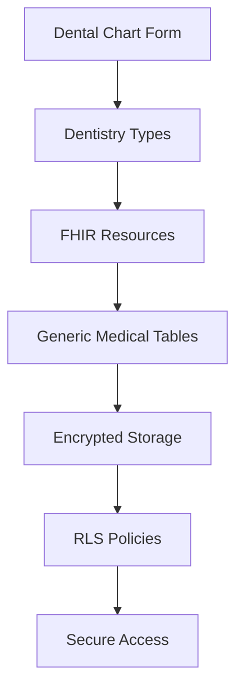

# 🦷 Dentistry Module

This module provides dentistry-specific extensions to the generic FHIR-compliant medical schema. It's designed to be **practitioner-agnostic** while providing specialized functionality for dental practices.

## 📁 Module Structure

```text
dentistry/
├── index.ts          # Core dentistry tables and indexes
├── seeds.ts          # Pre-populated dental codes and data
└── README.md         # This documentation
```

## 🗃️ Database Tables

### Core Dentistry Tables

| Table                    | Purpose                             | Key Fields                                           |
| ------------------------ | ----------------------------------- | ---------------------------------------------------- |
| `dentalObservationCodes` | Standardized dental condition codes | `code`, `category`, `description`, `fhirCode`        |
| `toothNumberingSystem`   | FDI tooth numbering system          | `toothNumber`, `toothName`, `arch`, `quadrant`       |
| `dentalProcedureCodes`   | ADA procedure codes                 | `code`, `category`, `description`, `typicalDuration` |
| `dentalChartTemplates`   | Reusable chart templates            | `name`, `templateData`, `isDefault`                  |

## 🦷 Dental Observation Codes

Based on your dental chart forms, these codes represent:

### Conditions

- **D** - Decayed (Caries Indicated for Filling)
- **M** - Missing due to Caries
- **MO** - Missing due to Other Causes
- **Im** - Impacted Tooth
- **Sp** - Supernumerary Tooth
- **Rf** - Root Fragment
- **Un** - Unerupted

### Restorations & Prosthetics

- **Am** - Amalgam Filling
- **Co** - Composite Filling
- **JC** - Jacket Crown
- **Ab** - Abutment
- **Att** - Attachment
- **P** - Pontic
- **In** - Inlay
- **Imp** - Implant
- **S** - Sealants
- **Rm** - Removable Denture

### Surgery

- **X** - Extraction due to Caries
- **XO** - Extraction due to Other Causes

## 🦷 Tooth Numbering System (FDI Notation)

### Permanent Teeth

- **Upper Right (1x)**: 18, 17, 16, 15, 14, 13, 12, 11
- **Upper Left (2x)**: 21, 22, 23, 24, 25, 26, 27, 28
- **Lower Left (3x)**: 38, 37, 36, 35, 34, 33, 32, 31
- **Lower Right (4x)**: 41, 42, 43, 44, 45, 46, 47, 48

### Deciduous Teeth

- **Upper Right (5x)**: 55, 54, 53, 52, 51
- **Upper Left (6x)**: 61, 62, 63, 64, 65
- **Lower Left (7x)**: 75, 74, 73, 72, 71
- **Lower Right (8x)**: 81, 82, 83, 84, 85

## 🦷 Dental Procedure Codes (ADA)

### Preventive Services

- **D0150** - Comprehensive oral evaluation
- **D1110** - Prophylaxis - adult
- **D1206** - Topical application of fluoride varnish

### Restorative Services

- **D2140** - Amalgam - one surface
- **D2391** - Resin-based composite - one surface, anterior

### Endodontic Services

- **D3310** - Endodontic therapy, anterior tooth
- **D3330** - Endodontic therapy, molar

### Surgical Services

- **D7140** - Extraction, erupted tooth
- **D7240** - Removal of impacted tooth - soft tissue

## 🔗 Integration with Generic Schema

### FHIR Resource Mapping

| Dental Data       | FHIR Resource         | Table                             |
| ----------------- | --------------------- | --------------------------------- |
| Tooth conditions  | `Observation`         | `observationFhirResource`         |
| Dental procedures | `Procedure`           | `procedureFhirResource`           |
| Patient info      | `Patient`             | `patientFhirResource`             |
| Consent forms     | `Consent`             | `consentFhirResource`             |
| X-ray reports     | `DiagnosticReport`    | `diagnosticReportFhirResource`    |
| Medical history   | `Condition`           | `conditionFhirResource`           |
| Allergies         | `AllergyIntolerance`  | `allergyIntoleranceFhirResource`  |
| Medications       | `MedicationStatement` | `medicationStatementFhirResource` |

### Form Data Mapping

| Form                 | Primary FHIR Resource | Supporting Resources                                     |
| -------------------- | --------------------- | -------------------------------------------------------- |
| **Dental Chart**     | `Observation`         | `DiagnosticReport`                                       |
| **Patient Info**     | `Patient`             | `AllergyIntolerance`, `Condition`, `MedicationStatement` |
| **Informed Consent** | `Consent`             | `RiskAssessment`                                         |
| **Treatment Record** | `Procedure`           | `FinancialTransaction`                                   |

## 🚀 Usage Examples

### Creating a Dental Observation

```typescript
import { observationFhirResource, dentalObservationCodes } from "@workspace/database/schema";

// Find the observation code
const decayCode = await db
  .select()
  .from(dentalObservationCodes)
  .where(eq(dentalObservationCodes.code, "D"))
  .limit(1);

// Create FHIR Observation resource
const observationData = {
  resourceType: "Observation",
  code: {
    coding: [
      {
        system: "http://loinc.org",
        code: decayCode[0].fhirCode,
        display: decayCode[0].description,
      },
    ],
  },
  subject: { reference: "Patient/patient-id" },
  valueString: "Tooth 16 - Decayed",
};

// Store in generic FHIR table
await db.insert(observationFhirResource).values({
  encounterId: encounterId,
  practitionerPatientId: practitionerPatientId,
  data: encrypt(JSON.stringify(observationData)),
  dataHash: hash(observationData),
});
```

### Querying Dental Data

```typescript
// Get all dental observations for a patient
const dentalObservations = await db
  .select()
  .from(observationFhirResource)
  .where(eq(observationFhirResource.practitionerPatientId, patientId));

// Decrypt and filter dental-specific observations
const dentalData = dentalObservations
  .map((obs) => JSON.parse(decrypt(obs.data)))
  .filter((obs) => obs.code.coding[0].system === "http://loinc.org");
```

## 🔒 Security & Privacy

- All FHIR data is **encrypted** at rest
- **Row Level Security (RLS)** policies control access
- **Data integrity** checking via hashes
- **Soft deletes** for audit compliance

## 🎯 Practitioner Scalability

This module is designed to be **practitioner-agnostic**:

✅ **Generic Schema** - Works for any medical specialty  
✅ **Specialty Extensions** - Dentistry-specific without breaking generics  
✅ **FHIR Compliance** - Standardized across all practitioners  
✅ **Modular Design** - Easy to add new specialties

### Adding New Specialties

To add a new specialty (e.g., Cardiology):

1. Create `src/schema/cardiology/index.ts`
2. Add specialty-specific tables
3. Export from main schema index
4. Add RLS policies
5. Create specialty-specific types

The generic FHIR resources remain unchanged!

## 📊 Data Flow



## 🛠️ Development

### Adding New Dental Codes

1. Update `seeds.ts` with new codes
2. Run migration to populate database
3. Update types if needed
4. Test with dental forms

### Customizing Chart Templates

1. Create new template in `dentalChartTemplates`
2. Define template structure in `templateData`
3. Set as default if needed
4. Use in dental chart forms

## 📚 References

- [FHIR R4 Specification](https://hl7.org/fhir/R4/)
- [ADA Dental Procedure Codes](https://www.ada.org/en/publications/cdt)
- [FDI Tooth Numbering System](https://www.fdiworlddental.org/resources/statistics/tooth-numbering-systems)
- [Dental Chart Symbols](https://www.dentalcare.com/en-us/professional-education/ce-courses/ce1/dental-charting)
